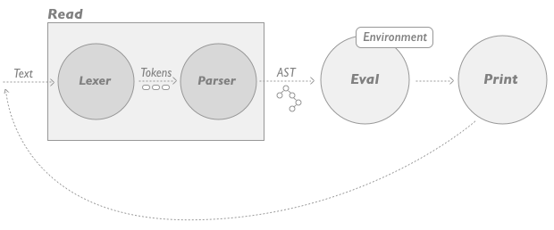

# 10. Динамическая верификация. Модульное и интеграционное тестирование. REPL. Doctest.

## Подходы к верификации

- Динамическая, осуществляется через эксперимент.
  - Быстрая и простая проверка конкретного сценария.
  - Требует детерминированности системы.
  - Доказывает наличие ошибки, а не отсутствие.
- Статическая, осуществляется через анализ кода как текста/формул.
  - Работает со свойствами, а не примерами. Общий случай.
  - Трудоёмка (если возможна) в сложных случаях.

:::{glossary}
Динамическая верификация
    Проверка корректности программы во время её выполнения. В отличие от статического анализа (проверка кода без запуска, например, линтеры), динамическая верификация требует выполнения кода.
:::
**Примеры:**

- Тестирование (модульное, интеграционное, системное).
- Отладка в runtime.
- Проверка через REPL.

---

## Модульное тестирование (Unit Testing)

:::{glossary}
Модульное тестирование (Unit Testing)
    тестирование отдельных компонентов программы (функций, классов, методов) **в изоляции** от других частей.
:::

**Особенности:**

- Используются **заглушки (моки, стабы)** для имитации зависимостей.
- Цель: убедиться, что каждый "кирпичик" работает правильно.

---

## Интеграционное тестирование (Integration Testing)

:::{glossary}
Интеграционное тестирование (Integration Testing)
    Интеграционное тестирование проверяет взаимодействие между несколькими модулями или компонентами системы. Цель — убедиться, что отдельные части программы работают вместе корректно.
:::

---

## REPL (Read-Eval-Print Loop)

:::{glossary}
REPL (Read-Eval-Print Loop)
    это интерактивная среда программирования, которая позволяет вводить код, выполнять его и сразу видеть результат.
:::

REPL может исполпользоваться как один из видов ручного динамического тестирования.

### Принцип работы REPL



### Требования к REPL

Чтобы REPL было удобно использовать для тестирования и разработки, он должен:

- Позволять вручную **изменять состояние** нашей программы в **runtime**.
- При возникновении ошибок или нежелательного результата REPL должен позволять **«на лету»** изменять реализацию функции или инструкции, при этом:
    1. Не теряя текущее состояние процесса.
    1. Не останавливая текущий процесс.
    Этот механизм называется "Hot Code Reloading" и является главным отличием REPL от обычных интерпретаторов.
- Позволяет **«на лету»** реализовывать программу. Иными словами, хороший REPL должен позволять по-настоящему редактировать код приложения.

#### Примеры

##### REPL Small Talk

При возникновении ошибок он допускает следующие способы её обработки:

- Доопределить функцию
- Подменить её вызов другой функцией прямо в runtime

##### Erlang

REPL Erlang можно привести запущенный сервер в состояние, в котором возникает ошибка, а затем исправлять код без его отключения.

##### Clojure

REPL Clojure позволяет подключиться к запущенному серверу, вызвать ошибку, замкнуть текущее состояние в глобальную переменную для дальнейшего исследования, внести изменения в код и повторно запустить тестовый сценарий.

---

## Doctest

:::{glossary}
Doctest
    инструмент, который проверяет примеры в документации, выполняя их как тесты.
:::

При его использовании, документация (например docstring) содержит:

1. Основное текстовое содержание
1. Примеры использования функции и ожидаемый результат

```python
def multiply(a, b):
    """
    Умножает два числа.
    
    Пример:
    >>> multiply(3, 4)
    12
    >>> multiply(-2, 5)
    -10
    """
    return a * b

# Запуск doctest: python -m doctest myfile.py
```

**Плюсы**

- Документация всегда актуальна (примеры проверяются автоматически).
- Простые тесты в одном месте с документацией.