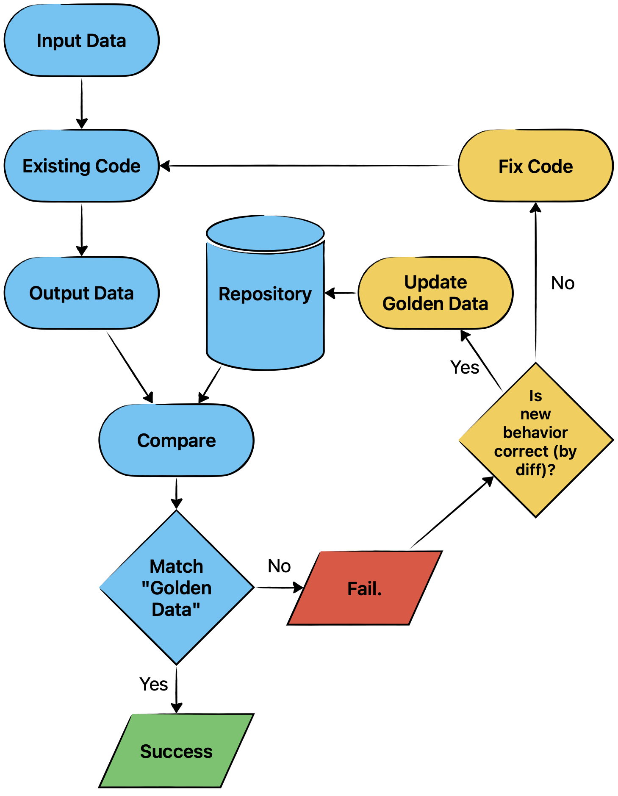
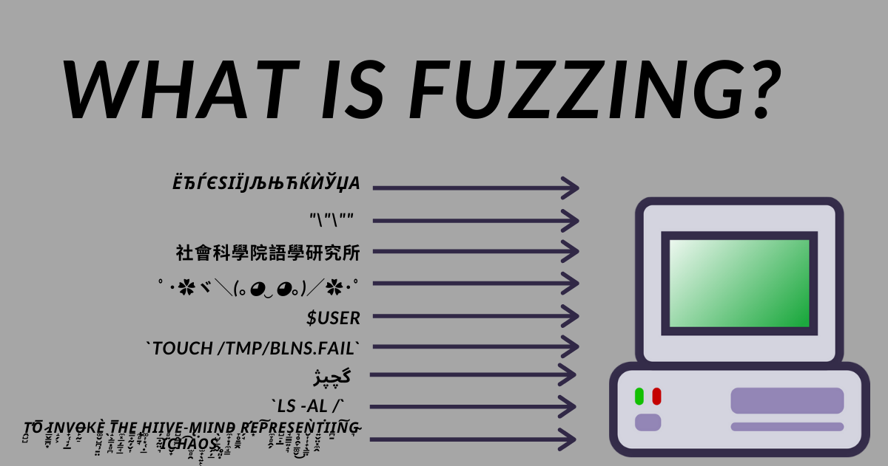
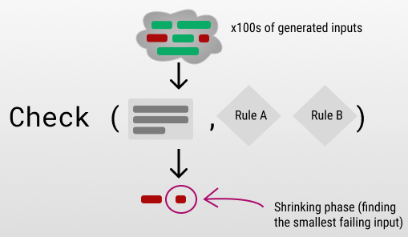

# 11. Динамическая верификация. Golden tests. Fuzzy/Monkey testing. Property-Based Testing

```{glossary}
Динамическая верификация
    Проверка соответсвия программы спецификации **во время её выполнения**, с помощью эксперимента(теста).
```

## Golden tests

```{glossary}
Golden tests
    это тесты, которые сравнивают результат работы программы с **эталонным результатом** ("золотым стандартом"). Если результат совпадает с эталоном, тест считается пройденным. Golden tests часто используются для регрессионного тестирования, чтобы убедиться, что изменения в коде не нарушили существующую функциональность.
```

**Pros**: Упрощает регрессионное тестирование для сложных выводов.

**Cons**: Хрупкий, если выходные данные часто меняются; требует тщательной ручной проверки.



````{dropdown} Пенской А.В.
### Golden Master Testing

<div class="row"><div class="col">

Как тестировать если результат:

- большой ($>$ экрана текста);
- нечитаем глазами, бинарный формат?

Golden Master Testing (Characterization Test):

1. Храним "золотой" результат работы как часть тестов.
2. Проверяем соответствие фактического и "золотого" результата.

В тестирование интерфейсов: Snapshot Testing

</div><div class="col">


</div></div>
````

## Fuzzy/Monkey testing

Fuzzy testing (или fuzz testing) и Monkey testing
: это методы тестирования, которые предполагают подачу на вход программы **случайных или некорректных данных** для проверки её устойчивости.

```{glossary}
Fuzzy testing
    Автоматизированная техника, при которой на вход программы подаются **случайные или специально сгенерированные данные** (например, с нарушением формата). Цель — найти уязвимости, сбои или неожиданное поведение.

Monkey testing
    Более хаотичный подход, при котором программа тестируется **случайными действиями** (например, случайные клики, отказы, сбои, неожиданный порядок запросов). Часто используется для тестирования пользовательских интерфейсов и распределенных систем.
```

````{dropdown} Пенской А.В.
### Fuzzy and Monkey Testing

Как снизить стоимость написания тестовых наборов данных?

- Генерировать тестовые данные (Fuzzy Testing) случаным образом.
- Генерировать последовательность событий (Monkey Testing) случаным образом (отказы, сбои, неожиданный порядок запросов).
- Проверять, **устояла ли** система под их воздействием.




````

## Property-Based Testing

```{glossary}
Property-Based Testing
    это подход к тестированию, в которой тесты проверяют общие **свойства** или **инварианты** кода с помощью **автогенерируемых** входов.
    (например, что дерево сбалансировано, или свойства моноида)
```

````{dropdown} Пенской А.В.
### Property-Based Testing

- Развитие идей Fuzzy/Monkey Testing
- Замена формального доказательства свойств на экспериментальное

<div class="row"><div class="col">

Примеры свойств:

- Монойд $<S, *, 1>$:
    - $(a * b) * c = a * (b * c)$
    - $a * 1 = 1 * a = a$
    - e.g.: $<str, ++, $""$>$; $<set, \cup, \emptyset>$; $<A, \cap, A>$
- Раскраска и балансировка red-black tree.
- Тотальность (остановка, не выбрасывает исключение)
- Эквивалентность исходной и оптимизированной программы

</div><div class="col">



1. Генератор входных данных.
1. Функция проверки свойства (не использует тестируемое).
1. «Сжатие» входных данных, в случае нарушения свойств.

</div></div>
````
