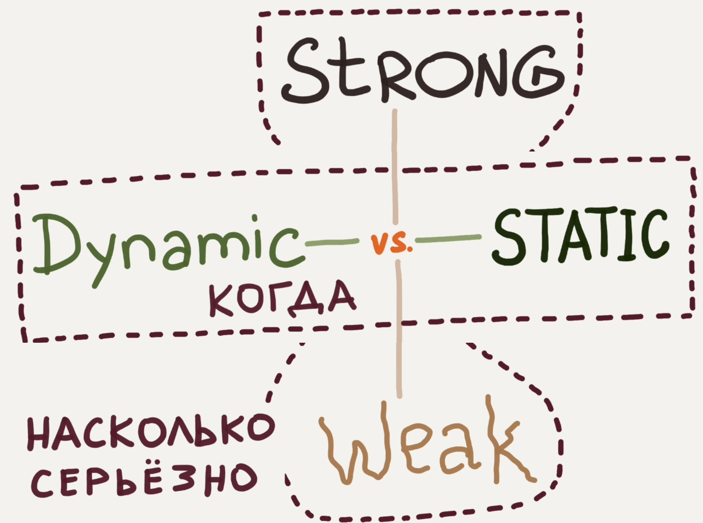
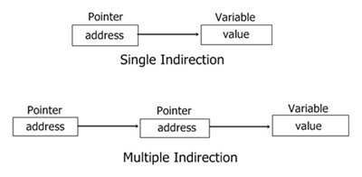
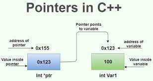

# 12. Статическая верификация. Виды систем типов. Понятие "объекта первого класса"

## Статическая верификация

```{glossary}
Статическая верификация
    это процесс анализа программного кода **без его выполнения** для обнаружения потенциальных ошибок и проверки **соответствия спецификациям**.
```

### Примеры и методы

- **Синтаксический и семантический анализ (ЯП):** Выявление ошибок в структуре кода.
- **Статические анализаторы:** Инструменты вроде линтеров, санитайзеров, которые ищут уязвимости, dead code или нарушения стиля.
- **Формальные методы: (Certified programming)** Математическое доказательство корректности кода (например, с использованием Coq или TLA+).
- **Проверка типов: (IO,STM, lifetime, ADT)** Компилятор проверяет соответствие типов (например, в Java, C++).
- **Темпоральная логика: (Temporal logic tools. Пример: SystemVerilog Assertions)** позволяет проверять временные свойства систем, что особенно важно для параллельных и аппаратных систем.
- **Модельная разработка: (Model-Driven Engineering. xtUML, Switch-технология. По построению)** упрощает создание сложных систем за счёт использования моделей как основного артефакта, а также автоматизации генерации кода и тестов.

## Виды систем типов

<div class="row"><div class="col">

```{glossary}
Система типов
    совокупность правил в языках программирования, назначающих свойства, именуемые типами, различным конструкциям, составляющим программу -- таким как переменные, выражения, функции или модули.
```

</div><div class="col">



</div></div>

- **По времени проверки:**
    - **Статическая типизация:** Типы проверяются на этапе компиляции (C++, Rust).
    - **Динамическая типизация:** Типы определяются во время выполнения (Python, JavaScript).
- **По строгости:**
    - **Сильная (строгая):** Запрещает неявные преобразования (Haskell, Rust).
    - **Слабая:** Допускает неявные преобразования (C, JavaScript).

## Понятие «объекта первого класса»

```{glossary}
Объект первого класса
    это сущность в языке программирования, которая может быть:
    - Передана как аргумент функции,
    - Возвращена из функции,
    - Присвоена переменной.
    - Проверена на эквивалентность (*Не обязательно -- Пенской А.В.).
```

Все остальные объекты -- **объекты второго класса**.

**Примеры объектов первого класса:**

- Значения и ссылки
- Указатели на функции
- Функции (Python/JS/...) и замыкания (Scala/Rust) (не везде)
- Классы (Python) (не везде)

**Не являются объектами первого класса:**

- Макросы в (C/C++, Clojure)
- Метки в различных ЯП

````{dropdown} Пенской А.В.
## Статическая верификация <br/> (by Formal Analysis)

<div class="row"><div class="col">

1. Синтаксис и семантика (ЯП)
2. Lint (плохие шаблоны)
3. **Систем типов** (IO, STM, lifetime, ADT)
4. Системы доказательства теорем. Certified programming
5. Temporal logic tools. Пример: SystemVerilog Assertions
6. Model-Driven Engineering. xtUML, Switch-технология. По построению

</div><div class="col">


</div></div>

---

## Система типов

- Происхождение
- Объекты первого класса
- Виды системы типов
- Неявная статическая типизация. Вывод типов
- Тотальность функций
- Полиморфизм

----

### Типы в компьютере. Происхождение*

`*` -- в основном неверное и неполное.
#### На уровне процессора

1. Машина фон Неймана. Типов нет, есть только действия.
   - Сказано -- складывать, буду складывать.
   - Огромное количество ошибок и уязвимостей.
1. Тегированные ЭВМ, машинное слово: `<tag><actual-data>`:
   - безопасность (нет нецелевому использованию!),
   - приведение типов, полиморфизм,
       - типизация операций, кол-во аргументов,
   - накладные расходы,
   - ошибка -- отказ?
1. Интерпретатор, ВМ: тоже самое.

Может не стоит писать ошибочный код?

---

### Indirection

**Indirection** (also called dereferencing) is the ability to reference something using a name, reference, or container instead of the value itself.




----

#### Объекты первого класса

<div class="row"><div class="col">

Элементы ЯП делятся на:

- **first-class object**:
    1. All items can be the actual parameters of functions.
    2. All items can be returned as a result of functions.
    3. All items can be the subject of assignment statements.
    4. `*` All items can be tested for equality.
- **second-class objects** -- все остальные.

</div><div class="col">

Примеры:

- значения, ссылки;
- указатели на функции;
- `*` функции, замыкания;
- метка для перехода;
- break/continue;
- `*` expressions, statements (if);
- namespace/module;
- тип (зависимые типы).

`*` -- проблема определения и проверки.

</div></div>

---

#### Типизация на уровне языка. Происхождение*

1. Фиксируем типы на уровне документации и сверяемся с ней.
1. Все типы известны. Имя функции включает аргументы/их типы:
    - `sort/1`, `sort/2`;
    - `ifTrue:`, `ifTrue:ifFalse:`, `ifFalse:`, `ifFalse:ifTrue:`
    - `int add(int, int)`, `float add(float, float)`
    - простейшая реализация через глобальный словарь.
1. Обобщённое программирование:
    - массивы в C -- синтаксический сахар поверх машины фон Неймана;
    - параметризируемые типы -- generics;
    - динамическая диспетчеризация -- интерфейсы.
1. Ограничения, вывод типов, поиск поддходящих вариантов.

----

### Виды системы типов

<div class="row"><div class="col">

Система типов
: совокупность правил в языках программирования, назначающих свойства, именуемые типами, различным конструкциям, составляющим программу -- таким как переменные, выражения, функции или модули.

</div><div class="col">


Наш акцент: статическая, строгая.

</div></div>

- Время: статическая $\longleftrightarrow$ динамическая
- Сила: сильная $\longleftrightarrow$ слабая

----

## Система типов и множества (поверхностно)

- Singletons: $A = \{ a \}$,  $B = \{ b \}$
- $Boolean=\{ true, false \}$
- Natural: $ N = \{ 1, 2... \}$ (определены на уровне железа)
- `enum {a, b}`
    - $=\{ a, b \}$
- `struct { A, B }`
    - $=A \times B= \{ (a, b) \}$
- `union { A, B }`
    - $= A \cup B = \{ a, b \}$

----
- Generics: `class Box<T>{T value;}`
    - $\equiv$ `data Box a = Box a`
    - $\equiv box(T) = T \times \{ box \}$
- Disjoint union: `data Either a b = Left a | Right b`
    - $\equiv either(A,B) = ( A \times \{ left \} ) \cup ( B \times \{ right \} )$
- Recursive type: `data List a = Cons a (List a) | Nil`
    - $\equiv list(A) = (A \times list(A) \times \{ cons \}) \cup \{ nil \}$
- `data Maybe a = Just a | Nothing`
    - $\equiv maybe(A) = (A \times \{ just \}) \cup \{ nothing \}$
    - `fromMaybe` -- unbox;
    - `int->int->int` -- use.
- `int?`$=N \cup \{ nil \}$
    - `int?->int?->int?`
        - run-time exception
        - cast `nil` to `0` or `1`
        - `nil` propagate `nil` (`nil + x = nil = x + nil`)
---

````
