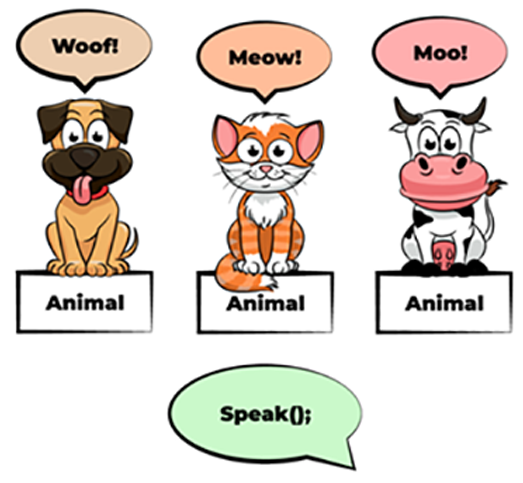

# 15. Полиморфизм. Специальный (ограниченный, через перегрузку, через приведение типов).

```{glossary}
Полиморфизм (Behavior Indirection: Polymorphism)
    это возможность использовать разные программные сущности с одинаковым интерфейсом в одинаковом контексте. Indirection уровня программной модели модели.
```

## Виды полиморфизма

1. **Универсальный** (universal)
    1. Параметрический (parametric) -- обощённые структуры и код, любые данные внутри.
    1. Наследование (subtyping) -- ООП, использование наслед.
1. **Специальный** (ad-hoc)
    1. Перегрузка (overloading)
        - Ограниченный (bounded)
        - Перегрузка имён функций (func. names overloading)
    1. Приведение типов (coercion)

### Специальный полиморфизм

Хотим использовать разные реализации для разных входных параметров, но вызывать метод одинаково.

1. **Перегрузка (overloading)**
    - Несколько методов с одним именем, но разными параметрами.
    - Вызываются аналогично друг-другу, компилятор решает какую-реализацию вызвать в зависимости от аргументов.
    ```java
    class Calculator {
        int add(int a, int b) { return a + b; }
        double add(double a, double b) { return a + b; }
    }
    ```
1. **Приведение типов (coercion)**
    - Неявное (или явное) преобразование типов для использования полиморфного поведения.
    - В некоторых функциональных языках есть такая вещь как **Multiple Dispatch**, которая позволяет доопределить функцию для аргументов разных типов (по сути перезагрузка методов/операторов). Таким образом мы сами контролируем неявное преобразование типов.
    ```javascript
    console.log("number: " + 42) // => number: 42
    console.log(1.5 + 1)         // => 2.5
    console.log(1 + 1 + '1')     // => 21
    console.log('1' + 1 + 1)     // => 111
    ```
1. **Ограниченный (bounded)**
    - аналогичен параметрическому полиморфизму, но с ограничением на типы входных параметров. К примеру, **ограничение на набор интерфейсных функций**, которые должны быть определены для типов, потенциально участвующих в подстановке.
    - **Параметризация с ограничениями на типы** (например для Java, требование реализации интерфейса).
    - Относится ли тип к определенному **классу типов**? **Type class’ы** в Haskell.
    ```java
    public <T extends Comparable<T>> T max(T a, T b) {
        return a.compareTo(b) > 0 ? a : b;
    }
    // T должен реализовывать Comparable<T>
    ```
    ```haskell
    class Eq a where
    (==) :: a -> a -> Bool
    (/=) :: a -> a -> Bool

    class (Eq a) => Ord a where
        compare :: a -> a -> Ordering
    ```
````{dropdown} Пенской А.В.
### Behavior Indirection: Polymorphism

<div class="row"><div class="col">

The key control flows indirection is a polymorphism. It allows developers to write code with indirection references to its implementation.

Polymorphism in programming
: is the ability to use different software entities (objects, data types, and so on) with the same interface in the same context.

</div><div class="col">



</div></div>

----

### Виды полиморфизма

<div class="row"><div class="col">

1. **Универсальный** (universal)
    1. Параметрический (parametric) -- обощённые структуры и код, любые данные внутри.
    1. Наследование (subtyping) -- ООП, использование наслед.
1. **Специальный** (ad-hoc)
    1. Перегрузка (overloading)
        - Ограниченный (bounded)
        - Перегрузка имён функций (func. names overloading)
    1. Приведение типов (coercion)

</div><div class="col">


Частично заимствовано тут:

- [Haskell Beginners 2022. <br/> Lecture 3: Typeclasses](https://slides.com/haskellbeginners2022/lecture-3)
- [Душкин Роман <br/> Полиморфизм в языке Haskell](https://fprog.ru/2009/issue3/roman-dushkin-haskell-polymorphism/)

</div></div>

---

### Universal. Один код, разные данные

```haskell
filterInt :: (Int -> Bool) -> [Int] -> [Int]
filterInt _ [] = []
filterInt p (x:xs)
    | p x = x : filterInt p xs
    | otherwise = filterInt p xs
```

```haskell
filterChar :: (Char -> Bool) -> [Char] -> [Char]
filterChar _ [] = []
filterChar p (x:xs)
    | p x = x : filterChar p xs
    | otherwise = filterChar p xs
```

----

#### Динамика

<div class="row"><div class="col">

```python
lst = [
    {'x': 1, 'y': 3, 'z': 7},
    {'x': 2, 'y': 2, 'z': 8},
    {'x': 3, 'y': 1, 'z': 1},
]
sorted(lst, key=lambda e: e['x'])
# => [ {'x': 1, 'y': 3, 'z': 7}
#    , {'x': 2, 'y': 2, 'z': 8}
#    , {'x': 3, 'y': 1, 'z': 1}]
sorted(lst, key=lambda e: e['y'])
# => [ {'x': 3, 'y': 1, 'z': 1}
#    , {'x': 2, 'y': 2, 'z': 8}
#    , {'x': 1, 'y': 3, 'z': 7}]
```

</div><div class="col">

1. The first element of a pair
1. Reversing a list
1. List length
1. Taking 5 elements from a list
1. Function composition
1. etc.

</div></div>

----

#### Параметрический (parametric) полиморфизм /1

```haskell
filter :: forall a. (a -> Bool) -> [a] -> [a]
filter _ [] = []
filter p (x:xs)
    | p x = x : filter p xs
    | otherwise = filter p xs

-- TypeApplications: @
filter @Int :: (Int -> Bool) -> [Int] -> [Int]
filter @String :: (String -> Bool) -> [String] -> [String]
```

----

#### Параметрический (parametric) полиморфизм /2

```haskell
data Maybe a = Just a | Nothing
type MaybeInt = Maybe Int
```

```java
public class Box<T> {
    private T t;
    public void set(T t) { this.t = t; }
    public T get() { return t; }
}
```

----

#### Неприятные ограничения

```haskell
normalize :: String -> String
normalize = show . read

normalize :: forall a. (Read a, Show a) => String -> String
normalize s =
  let v :: a
      v = read s
     in show v

normalize @Int "123"
```

---

### Один интерфейс, разный код

<!-- (defvar the-dog (make-instance 'dog :name "Patric")) -->

<div class="row"><div class="col">

```python
class Dog():
    def __init__(self, name):
        self.name = name

    def dogSay(self):
        return 'Bork'
```

```python
class Cat():
    def __init__(self, name):
        self.name = name

    def catSay(self):
        return 'Meow'
```

</div><div class="col">

```lisp
(defclass dog ()
  ((name :initarg :name)))

(defun dogSay (dog) 'bork)
```

```lisp
(defclass cat ()
  ((name :initarg :name)))

(defun catSay (cat) 'meow)
```

</div></div>

----

#### Universal. <br/> Наследование (subtyping) полиморфизм /1

<div class="row"><div class="col">

```python
class Pet():
    def __init__(self, name):
        self.name = name

    def say(self):
        raise NotImplemented()

class Dog(Pet):
    def say(self):
        return 'Bork'

class Cat(Pet):
    def say(self):
        return 'Meow'
```

</div><div class="col">

```lisp
(defgeneric say (obj))

(defmethod say ((obj dog)) 'bork)
(defmethod say ((obj cat)) 'meow)

(defvar pets
  (list
    (make-instance 'dog :name "Patric")
    (make-instance 'cat :name "Snowball")))

(loop for pet in pets
      collect (say pet)) ; => (BORK MEOW)
```

</div></div>

----

#### Universal. <br/> Наследование (subtyping) полиморфизм /2

```python
class MyInt(int):
    def __init__(self, x):
        self.value = x
    def __lt__(self, other): # reversed!
        return other.value < self.value

sorted([7, 8, 1]) # => [1, 7, 8]
sorted([MyInt(7), MyInt(8), MyInt(1)]) # => [8, 7, 1]
```

----

#### Universal. <br/> Наследование (subtyping) полиморфизм /3 <br/> If-Statement in Smalltalk

<div>

<div class="row"><div class="col">

```smalltalk
Bool subclass: #Object !

True subclass: #Bool
  ifTrue: aBlock ifFalse: bBlock
    ^ aBlock value ! !

False subclass: #Bool
  ifTrue: aBlock ifFalse: bBlock
    ^ bBlock value ! !
```

</div><div class="col">

```smalltalk
(17 * 13 > 220).
>>>true
"17.add(13).more(220) => True"

(17 * 13 > 220)
       ifTrue: [ 'bigger' ]
       ifFalse: [ 'smaller' ].
>>>'bigger'
"17.add(13).more(220)
   .ifTrueIfFalse(
     lambda: 'bigger',
     lambda: 'smaller' ) => 'bigger'"

n := 1.
[ n < 1000 ] whileTrue: [ n := n*2 ].
n
>>> 1024
```

</div></div>

</div> <!-- .element: class="fragment" -->

---

### Одинаковый вызов, разные интерфейсы

```java
class Sum {
    public static int intSum(int x, int y) {
        return (x + y);
    }
    public static double doubleSum(double x, double y) {
        return (x + y);
    }
    public static void main(String args[]) {
        System.out.println(Sum.intSum(10, 20));
        System.out.println(Sum.doubleSum(10.5, 20.5));
    }
}
```

----

#### Ad-Hoc. Перегрузка имён функций (overloading)

```java
public class Sum {
    public static int sum(int x, int y) {
        return (x + y);
    }
    public static double sum(double x, double y) {
        return (x + y);
    }
    public static void main(String args[]) {
        System.out.println(Sum.sum(10,   20  ));
        System.out.println(Sum.sum(10.5, 20.5));
    }
}
```

----

### Разные типы, один оператор

```python
print("number: " + str(42))  # => number: 42
print(1.5 + float(1))        # => 2.5
print(1 + 1 + int('1'))      # => 3
print(int('1') + 1 + 1)      # => 3
```

#### Ad-Hoc. Приведение типов (coercion)

```javascript
console.log("number: " + 42) // => number: 42
console.log(1.5 + 1)         // => 2.5
console.log(1 + 1 + '1')     // => 21
console.log('1' + 1 + 1)     // => 111
```

Как это реализовать без поддержки со стороны языка?

----

#### Multiple Dispatch (Julia)

```julia
add(x::Int64,  y::Int64)  = x + y
add(x::Int64,  y::String) = x + parse(Int64, y)
add(x::String, y::Int64)  = parse(Int64, x) + y
add(x::String, y::String) = parse(Int64, x) + parse(Int64, y)

add(1,   41  ) # => 42
add(1,   "41") # => 42
add("1", 41  ) # => 42
add("1", "41") # => 42
add(1,   41.0) # => ?
```

```julia
# => ERROR: MethodError: no method matching add(::Int64, ::Float64)
#    Closest candidates are:
#      add(::Int64, ::Int64) at REPL[45]:1
#      ...
```
<!-- .element: class="fragment" -->

----

#### Multiple Dispatch (Common Lisp)

```lisp
(defgeneric add (x y)
  (:method (x y)
    (error "method undefined")))

(defmethod add ((x integer) (y integer)) (+ x y))
(defmethod add ((x integer) (y string) ) (+ x (parse-integer y)))
(defmethod add ((x string)  (y integer)) (+ (parse-integer x) y))
(defmethod add ((x string)  (y string) ) (+ (parse-integer x) (parse-integer y)))

(add 1   2  ) ; => 3
(add 1   "2") ; => 3
(add "1" 2  ) ; => 3
(add "1" "2") ; => 3
(add 1.0 2  )
; => debugger invoked on a SIMPLE-ERROR in thread
;    #<THREAD "main thread" RUNNING {1001560143}>:
;      method undefined
;     ...
```

---

### Один код, разные данные с ограничениями

#### Ad-Hoc. Ограниченный (bounded) полиморфизм

```haskell
maxInt :: Int -> Int -> Int
maxInt x y = if x > y then x else y
```

```haskell
maxChar :: Char -> Char -> Char
maxChar x y = if x > y then x else y
```

```haskell
max :: forall a. Ord a => a -> a -> a
max x y = if x > y then x else y
```

----

#### Type Class

Type class
: is a type system construct that supports ad hoc polymorphism. This is achieved by adding constraints to type variables in parametrically polymorphic types. Such a constraint typically involves a type class T and a type variable a, and means that a can only be instantiated to a type whose members support the overloaded operations associated with T.

```haskell
class Eq a where
  (==) :: a -> a -> Bool
  (/=) :: a -> a -> Bool

class (Eq a) => Ord a where
    compare :: a -> a -> Ordering
```

----

##### Proposal: Remove method `/=` from class `Eq`

```haskell
class Eq a where
  (==) :: a -> a -> Bool
  (/=) :: a -> a -> Bool
```

```haskell
class Eq a where
  (==) :: a -> a -> Bool

a /= b = not (a == b)
```

Ваше мнение?

[link](https://github.com/haskell/core-libraries-committee/issues/3)

----

#### Reference Transperency vs. Type Classes

```haskell
data Maybe a = Just a | Nothing
```

<div class="row"><div class="col">

```haskell
isNothingL Nothing = True
isNothingL _       = False
```

</div><div class="col">

```haskell
isNothingR a
  | a == Nothing = True
isNothingR _     = False
```

</div></div>

Сравните эти две реализации?

<div>

<div class="row"><div class="col">

```haskell
isNothingL :: _ -> _
isNothingL :: Maybe _ -> Bool
isNothingL :: forall a. Maybe a -> Bool
```

</div><div class="col">

```haskell
instance Eq a => Eq (Maybe a) where
    Nothing == Nothing = True
    Just  a == Just  b = a == b
    _       == _       = False

isNothingR :: _ -> _
isNothingR :: Maybe _ -> Bool
isNothingR
  :: forall a. Eq (Maybe a) => Maybe a -> Bool
isNothingR
  :: forall a. Eq a => Maybe a -> Bool
```

</div></div>

</div> <!-- .element: class="fragment" -->

----

#### Экзистенциальные типы

Тип скрывающий переменную типа с заданными ограничениями.

```haskell
xs = [1, "1", 'c']
-- => <interactive>:4:14: error:
--      • Couldn't match type ‘Char’ with ‘[Char]’
--        Expected: String
--          Actual: Char
--      • In the expression: 'c'
--        In the expression: [1, "1", 'c']
--        In an equation for ‘xs’: xs = [1, "1", 'c']

data Obj = forall a. (Show a) => Obj a
xs = [Obj 1, Obj "foo", Obj 'c']

doShow :: [Obj] -> String
doShow [] = ""
doShow ((Obj x):xs) = show x ++ doShow xs
doShow xs  -- => 1"foo"'c'

instance Show Obj where show (Obj x) = show x
show xs    -- => [1,foo",'c']
```
````
