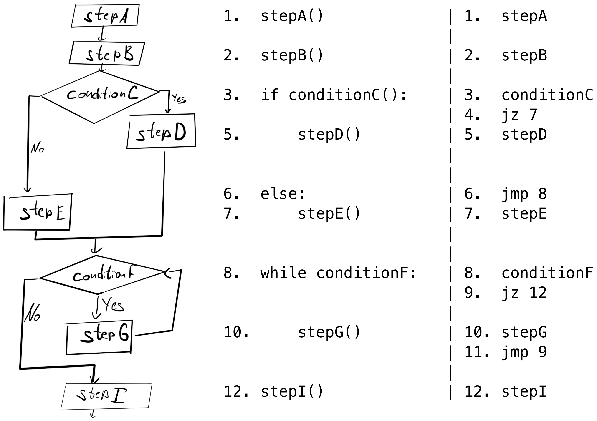
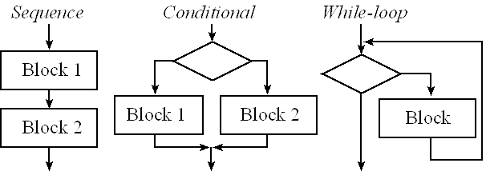
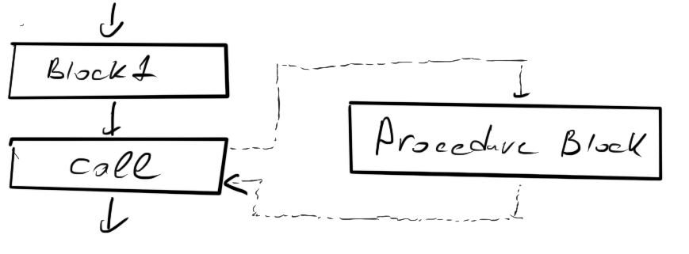
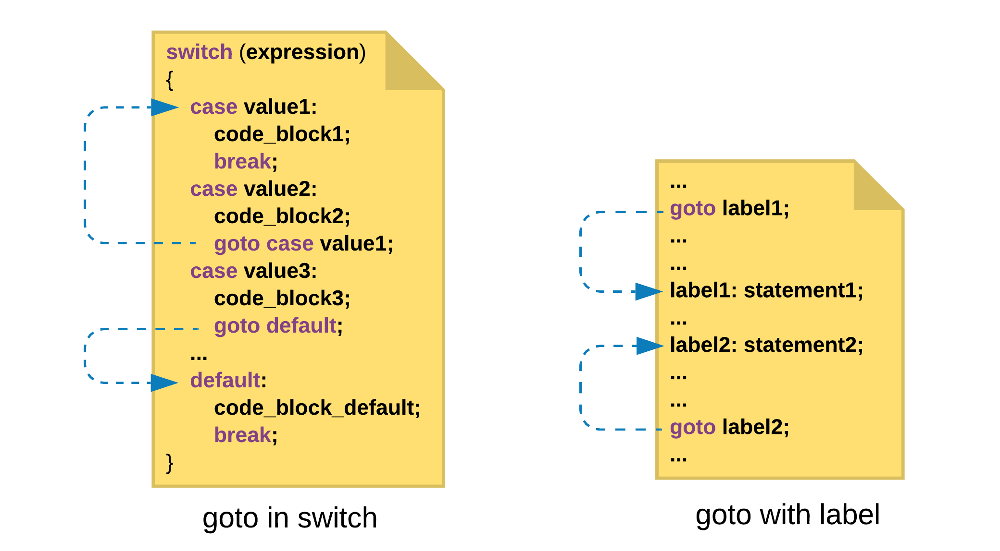
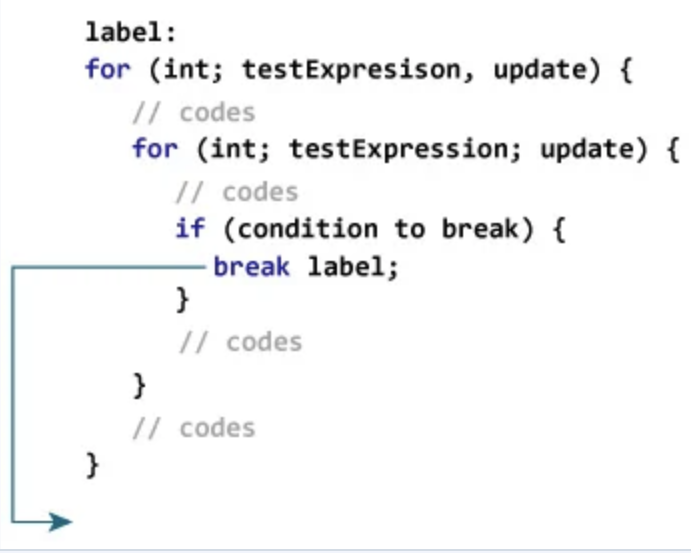
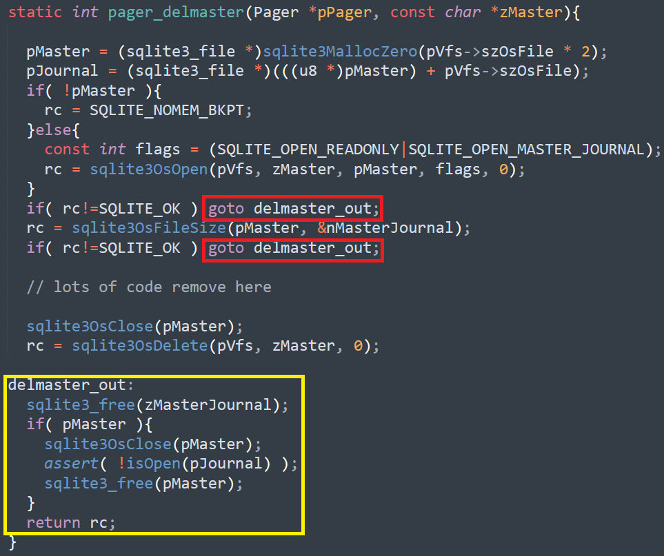
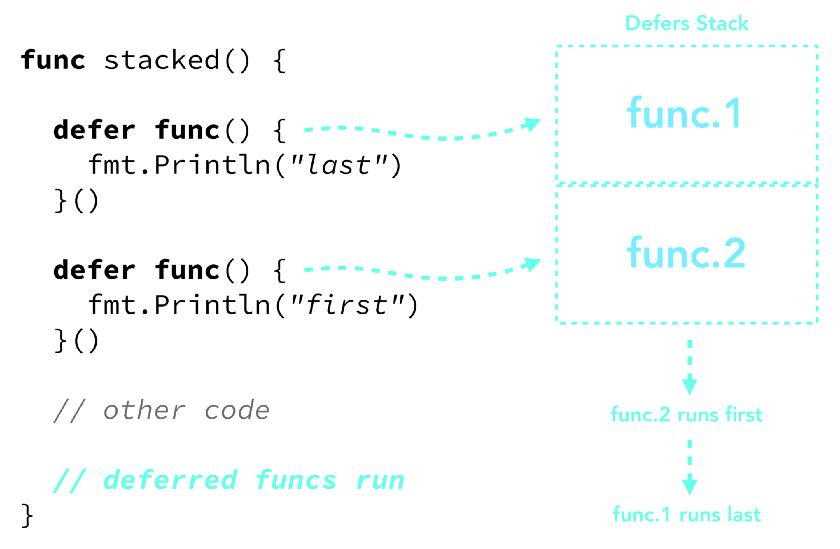

# 18. Структурное программирование, преимущества перед языками с Go To. Аргументация Дейкстры против Go To. Варианты практичного использования Go To сегодня. Механизм Defer языка Golang.

## Структурное программирование

- Его суть заключается в том, чтобы программировать не инструкции, а структурные блоки.
- одна точка входа
- *одна точка выхода

```{glossary}
Структурное программирование
    Парадигма, основанная на использовании структурных блоков: **последовательности**, **ветвления (if/else)** и **циклов (for, while)**.
```

## Аргументация Дейкстры против Go To

В статье «Go To Statement Considered Harmful» (1968) Эдсгер Дейкстра критиковал Go To:

В ней, на примере простой программы на псевдоструктурном и псевдонизкоуровневом языке он пытается написать трассу выполнения программы. Главным критерием оценки являлось то, насколько просто **написать эту трассу**

<div class="row"><div class="col">

| Структурное | Низкоуровневое   |
| ----------- | ---------------- |
| 1           | 1 |
| 2           | 2 |
| 3.5         | 4.5 |
| 8           | 4.8 |
| 8[1].10     | 4.9.10 |
| 12          | 4.9.10.9.10.9.12 |

</div><div class="col">



</div></div>

При построении трассы сразу видно, что благодаря **наличиную логических блоков** в структурном подходе мы можем явно определить, в какой момент **закончилась та или иная часть программы (видна точка выхода)**, в то время как в низкоуровневом варианте такой маркер отсутствует (не видна точка выхода).

## Отличие Python от классического структорного программирование

- `Exceptions`
-`Return`
- `Break/Continue`

## Варианты практичного использования Go To сегодня

1. Конечные автоматы.
2. Выход из вложенных циклов.
3. Освобождение ресурсов.

## Механизм Defer языка Golang

### Принцип работы

- `defer` откладывает выполнение функции до завершения текущей функции (даже при exception).
- **Порядок выполнения**: LIFO (последний добавленный `defer` выполняется первым).

### Преимущества

- **Гарантированная очистка ресурсов**: Закрытие файлов, освобождение мьютексов.
- **Устранение дублирования**: Нет необходимости писать очистку перед каждым return.

### Пример

```go
func readFile() error {
    file, err := os.Open("file.txt")
    if err != nil {
        return err
    }
    defer file.Close() // Закрытие гарантировано
    // ... работа с файлом
    return nil
}
```

````{dropdown} Пенсков А.В.
### Структурное программирование

<div class="row"><div class="col">

Было: последовательность инструкций.

Стало: последовательность структурных блоков.

- одна точка входа

    ```haskell
    fac n = fac' n 1
    fac' n acc = undefined
    ```

- одна точка выхода
    - `continue`
    - `break`
    - `return`

</div><div class="col">





</div></div>

---

## Go To Statement <br/> Considered Harmful

(Edsger Dijkstra)

Низкоуровневое программирование и Go To позволяют:

- тонкая ручная оптимизация;
- оптимальный код;
- разного рода хаки.

А чем Go To плох?


---

### Как описать текстом текущий шаг программы?

<div class="row"><div class="col">

| Структурное | Низкоуровневое   |
| ----------- | ---------------- |
| 1           | 1 |
| 2           | 2 |
| 3.5         | 4.5 |
| 8           | 4.8 |
| 8[1].10     | 4.9.10 |
| 12          | 4.9.10.9.10.9.12 |

</div><div class="col">


</div></div>

---

## Go To. Может быть полезен?

<div>

1. Конечные автоматы.
2. Выход из вложенных циклов.
3. Освобождение ресурсов.

</div><!-- .element: class="fragment" -->

---

### Go To. Конечные автоматы




---

### Go To. Выход из вложенных циклов

<div class="row"><div class="col">

Подходы к реализации:

1. использование флагов
1. использование именованных циклов
1. использование Go To

</div><div class="col">



</div></div>

---

### Go To. Освобождение ресурсов

<div class="row"><div class="col">

Подходы к реализации:

1. использование флагов (запрет использования `return`)
1. использование Go To
1. использование defer (см. на след. слайде)

</div><div class="col">



</div></div>

---

#### Go lang. Освобождение ресурсов. Defer



---
````
