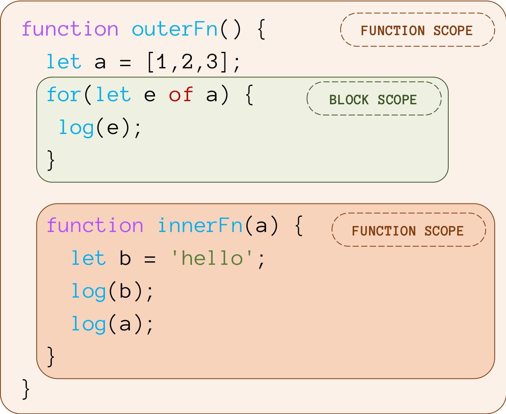

# 20. Нарушение структурной организации кода. Динамическая область видимости переменных.

## Лексическая область видимости (Lexical Scoping)

<div class="row"><div class="col">



</div><div class="col">

1. **Видимость переменных определяется их положением в коде:**
    - Переменные доступны только в той области, где они были **объявлены**, и во всех её **вложенных** областях.
    - Внешняя область видимости передаёт доступ к своим переменным **во внутренние области**.
2. **Замыкание (Closure):**
    - Вложенные функции **«запоминают» лексическую область**, в которой они были созданы, и сохраняют доступ к её переменным даже после завершения выполнения внешней функции.
3. **Перекрытие переменных (Shadowing):**
    - Внутренняя область видимости может объявить переменную **с таким же именем**, как во внешней области. В этом случае внешняя переменная будет **«скрыта»** внутри внутренней области.

</div></div>

## Динамическая область видимости (Dynamic Scoping)

1. **Видимость переменных зависит от контекста выполнения**

### Динамические переменные в Clojure

- Динамические переменные объявляются с метаданными `^:dynamic` и изменяются через `binding`

#### Как это работает

- `binding` создает новый динамический контекст для переменной. Все вызовы внутри этого контекста будут «видеть» новое значение.
- Значение переменной **восстанавливается** после выхода из блока binding.
- Динамические переменные потокобезопасны: изменения внутри `binding` не затрагивают другие потоки.
- С помощью `set!` можно изменить значение динамической переменной на глобальном уровне, что влияет на весь код, где она используется.

##### Пример

```clojure
;; Объявляем динамическую переменную (по соглашению, имя заканчивается на *)
(def ^:dynamic *db-host* "localhost:5432")

;; Функция, использующая динамическую переменную
(defn connect-to-db []
  (println "Connecting to" *db-host*))

;; Вызов без изменения контекста
(connect-to-db) ; => "Connecting to localhost:5432"

;; Переопределение значения в рамках binding
(binding [*db-host* "test-host:1234"]
  (connect-to-db)) ; => "Connecting to test-host:1234"

;; Вне блока binding значение остается исходным
(connect-to-db) ; => "Connecting to localhost:5432"
```

````{dropdown} Пенской А.В.
## Вопреки структуре. Vars Scope

<div class="row"><div class="col">

### Lexical Scope


Scope переменных

- "визуальный" $\uparrow$
- по стеку вызова $\longrightarrow$

</div><div class="col">

### Dynamic Scope

```clojure
(ns foo.lib)
(def ^:dynamic *token* :default-token)
(defn login [] (str "login " *token*))

(login) ; => "login :default-token"

(binding [*token* :other-token]
  (login)) ; => "login :other-token"

;;;;;;;;;;;;;;;;;;;;;;;;;;;;;;;;;;;;;;;;;;;;;;;;
(ns foo.main)

(foo.lib/login) ; => "login :default-token"

(binding [foo.lib/*token* :main-token]
  (foo.lib/login)) ; => "login :main-token"

(set! foo.lib/*token* :new-def-token)

(foo.lib/login) ; => "login :new-def-token"

(binding [foo.lib/*token* :main-token]
  (foo.lib/login)) ; => "login :main-token"
```

<div>
````