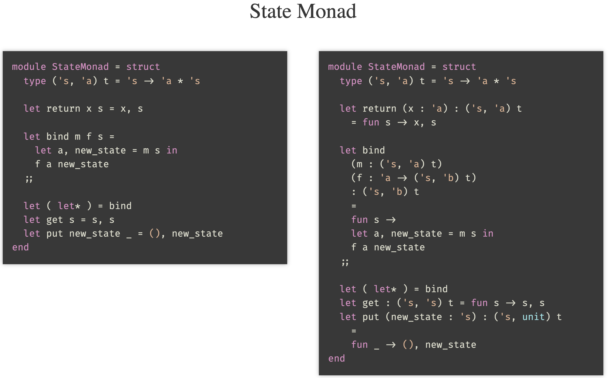
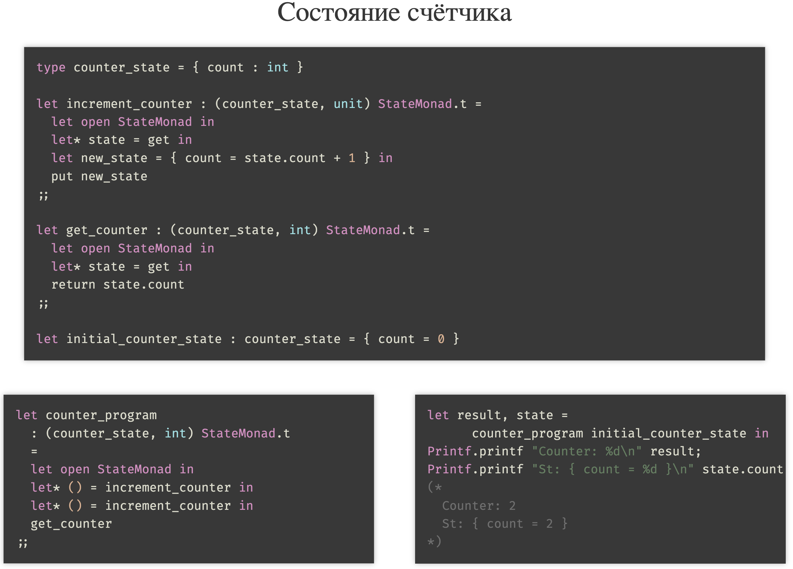
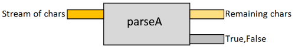

# 21. Монады. Связывание операций. Монада Identity, Maybe и State

```{glossary}
Монады
    это абстракция в функциональном программировании, предназначенная для организации последовательных цепочек вычислений с учётом контекста (побочных эффектов).
```

- `bind` (`>>=`) -- связывание цепочки вычислений;
- `return` -- "засовывание" значения в цепочку;

## Свойства монад

- **Левая идентичность:** `return x >>= f ≡ f x`
    - Если значение `x` обёрнуто в монаду `(return x)`, а затем передано в функцию `f` через `>>=`(== `bind`), результат должен быть эквивалентен прямому применению `f` к `x`.
- **Правая идентичность:** `m >>= return ≡ m`
    - Если монадическое значение `m` связывается с `return`, результат должен остаться `m`.
- **Ассоциативность** (после $\eta$ редукции):
    - `(m >>= f) >>= g ≡ m >>= (\x -> f x >>= g)`.
    - Порядок связывания операций не должен влиять на результат.

## Монада Identity

**Назначение:** Простейшая монада без дополнительного поведения. Передаёт значение следующей функции напрямую.

<div class="row"><div class="col">

```ocaml
let counter = ref 0

let bind x f =
  let cnt = !counter in
  Printf.printf "call[%d](%d)...\n" cnt x;
  counter := !counter + 1;
  let y = f x in
  Printf.printf "call[%d](%d) => %d\n" cnt x y;
  y
;;

let ( let* ) = bind;;
```

</div><div class="col">

```ocaml
let* a = 1 in
let* b = 2 in
let* c = 3 in
a + b + c
(* =>
   call[0](1)...
   call[1](2)...
   call[2](3)...
   call[2](3) => 6
   call[1](2) => 6
   call[0](1) => 6

   - : int = 6
*)
```

</div></div>

## Монада Maybe
**Назначение:** Обрабатывает вычисления, которые могут завершиться неудачей (`Nothing`).
    - **Связывание:** Если значение `Just x`, применяет функцию к `x`. Если `Nothing`, пропускает остальные операции.

Сделать тип `Maybe` монадой:

- определить функцию `bind` -- связывание цепочки вычислений;
- сделать функцию `return` -- "засовывание" значения в цепочку.

<div class="row"><div class="col">

```ocaml
module MaybeMonad = struct
  include Maybe

  let bind
    (m : 'a Maybe.t)
    (f : 'a -> 'b Maybe.t)
    : 'b Maybe.t
    =
    match m with
    | Nothing -> Nothing
    | Just x -> f x
  ;;

  let return (x : 'a) : 'a Maybe.t =
    Just x
  ;;

  let ( let* ) = bind
end
;;
```

</div><div class="col">

```ocaml
let open MaybeMonad in
bind (get_a ()) (fun a ->
  bind (get_b a) (fun b ->
    bind (get_c b) (fun c ->
      return (a + b + c))))
;;

let open MaybeMonad in
let* a = return 1 in
let* b = return 2 in
let* c = return 3 in
return (a + b + c)
;;
```

</div></div>

## Монада State

**Назначение:** Управляет изменяемым состоянием в функциональном стиле. Каждая операция принимает состояние и возвращает новое.

**Связывание:** Передаёт результат выполнения и состояние неявно между операциями.

- Формируем контекст вычислений.
- Последовательно исполняем действия читающие/пишущие контекст.
- Формируем "изменяемые" переменные в контексте.




````{dropdown} Пенской А.В.
{cite}`пенской2024КурсФП`

# Функциональное программирование

## Лекция 8

## Monads

Пенской А.В., 2024

----

## План лекции

- Монады это?
- Identity Monad
- Maybe Monad
- State Monad

---

## Монады. Что такое монады?


- [Brian Beckman: Don't fear the Monad](https://www.youtube.com/watch?v=ZhuHCtR3xq8)
- [D. Kovanikov: Haskell Beginners 2022 -- Monads and IO](https://slides.com/haskellbeginners2022/lecture-4)
- [D. Kovanikov: Beginner-friendly introduction to Free Monads](https://youtu.be/JPs0NRRIqUU?si=lukdDuPM-bpGS61d)

----

### Монады это

- это просто моноид в категории эндофункторов. <!-- .element: class="fragment" -->
- это костыль для ввода-вывода в ленивом Haskell. <!-- .element: class="fragment" -->
- это элементарная единица бытия, которая не имеет частей, а значит, не может быть разрушена или изменена извне. <!-- .element: class="fragment" -->
- это отличный инструмент для организация последовательных вычислений. <!-- .element: class="fragment" -->

<div>

### Посмотрим на примерах. На OCaml

- Обычный язык, с обычным поведением (изменяемые состояния, побочные эффекты и т.п.).
- Простой синтаксис.
- Удобен для монад (можно и на Python, но нет хороших лямбд).

</div>  <!-- .element: class="fragment" -->

---

## OCaml. Базовый синтаксис. Identity Monad

Определение значений уровня модуля:

```ocaml
let a = 1
let b = 2
let c = 3;;

a + b + c (* => - : int = 6 *);;
```

Определения с локальной областью видимости:

```ocaml
let a = 1 in
let b = 2 in
let c = 3 in
a + b + c (* => - : int = 6 *);;
```

Как работает этот синтаксис?

----

Локальное значение через функцию:

```ocaml
(fun a ->
  (fun b ->
    (fun c ->
        a + b + c
    ) 3
  ) 2
) 1
(* => - : int = 6 *);;
```

Вызов функций слева направо:

```ocaml
let bind x f = f x;;

bind 1 (fun a ->
  bind 2 (fun b ->
    bind 3 (fun c ->
      a + b + c)))  (* => - : int = 6 *);;
```

----

Синтаксис `let*`, синтаксический сахар:

<div class="row"><div class="col">

```ocaml
let* a = 1 in
let* b = 2 in
let* c = 3 in
a + b + c (* => - : int = 6 *);;
```

</div><div class="col">

```ocaml
bind 1 (fun a ->
  bind 2 (fun b ->
    bind 3 (fun c ->
      a + b + c))) (* => - : int = 6 *);;
```

</div></div>

Позволяет вызвать `bind` неявно, при передаче аргумента.

Зачем?

----

Добавим журнал передачи аргументов:

<div class="row"><div class="col">

```ocaml
let counter = ref 0

let bind x f =
  let cnt = !counter in
  Printf.printf "call[%d](%d)...\n" cnt x;
  counter := !counter + 1;
  let y = f x in
  Printf.printf "call[%d](%d) => %d\n" cnt x y;
  y
;;

let ( let* ) = bind;;
```

</div><div class="col">

```ocaml
let* a = 1 in
let* b = 2 in
let* c = 3 in
a + b + c
(* =>
   call[0](1)...
   call[1](2)...
   call[2](3)...
   call[2](3) => 6
   call[1](2) => 6
   call[0](1) => 6

   - : int = 6
*)
```

</div></div>

А можно и изменить поведение "вызова функций".

---

## Поток управления. Maybe Monad

- Контроль за потоком управления.
    - если `Just`/`Some`/`some?` -- продолжаем выполнять действия;
    - если `Nothing`/`None`/`nil?` -- останавливаем вычисления и возвращаем ничего.
- Swift: Optional Chaining
- Rust: `if_chain!`
- Clojure: `some->`
- etc.

----

`Maybe`/`Optional` Type

<div class="row"><div class="col">

```ocaml
module Maybe = struct
  type 'a t =
    | Nothing
    | Just of 'a

  let is_nothing = function
    | Nothing -> true
    | Just _ -> false
  ;;

  let from_just = function
    | Nothing -> failwith "from_just: Nothing"
    | Just x -> x
  ;;
end
;;
```

</div><div class="col">

```ocaml
Maybe.Just 1
(* => - : int Maybe.t = Maybe.Just 1 *);;
Maybe.Nothing
(* - : 'a Maybe.t = Maybe.Nothing *);;

let open Maybe in
let a = Just 1 in
is_nothing a
(* - : bool = false *);;

let open Maybe in
let a = Just 1 in
from_just a
(* - : int = 1 *);;

let open Maybe in
let a = Nothing in
from_just a
(* Exception: Failure "from_just: Nothing". *);;
```

</div></div>

----

Сложим `3` рачётных значения `int Maybe.t`:

```ocaml
let get_a _ = Maybe.Just 1
let get_b _ = Maybe.Just 2
let get_c _ = Maybe.Just 3;;

let open Maybe in
let a = get_a () in
let b = get_b () in
let c = get_c () in
if is_nothing a || is_nothing b || is_nothing c
then Nothing
else Just (from_just a + from_just b + from_just c)
(* - : int Maybe.t = Maybe.Just 6 *)
;;
```

Чем плох данный код?

----

- Всегда считает все 3 выражения (включая побочные эффекты).
- `get_b` и `get_c` не могут использовать предыдущие результаты.
- Boilerplate code.

<div class="row"><div class="col">

```ocaml
let open Maybe in
match get_a () with
| Nothing -> Nothing
| Just a ->
  (match get_b a with
   | Nothing -> Nothing
   | Just b ->
     (match get_c b with
      | Nothing -> Nothing
      | Just c -> Just (a + b + c)))
(* - : int Maybe.t = Maybe.Just 6 *)
```

</div><div class="col">

```ocaml
let open Maybe in
let a = get_a () in
if is_nothing a
then Nothing
else (
  let b = get_b (from_just a) in
  if is_nothing b
  then Nothing
  else (
    let c = get_c (from_just b) in
    if is_nothing c
    then Nothing
    else Just (from_just a + from_just b + from_just c)))
```

</div></div>

- More boilerplace code!
- Что можно с этим сделать?

----

Сделать тип `Maybe` монадой:

- определить функцию `bind` -- связывание цепочки вычислений;
- сделать функцию `return` -- "засовывание" значения в цепочку.

<div class="row"><div class="col">

```ocaml
module MaybeMonad = struct
  include Maybe

  let bind
    (m : 'a Maybe.t)
    (f : 'a -> 'b Maybe.t)
    : 'b Maybe.t
    =
    match m with
    | Nothing -> Nothing
    | Just x -> f x
  ;;

  let return (x : 'a) : 'a Maybe.t =
    Just x
  ;;

  let ( let* ) = bind
end
;;
```

</div><div class="col">

```ocaml
let open MaybeMonad in
bind (get_a ()) (fun a ->
  bind (get_b a) (fun b ->
    bind (get_c b) (fun c ->
      return (a + b + c))))
;;

let open MaybeMonad in
let* a = return 1 in
let* b = return 2 in
let* c = return 3 in
return (a + b + c)
;;
```

Что мы сейчас сделали?

</div></div>

----

- Сформировали шаблон для последовательных вычислений.
- Выделили возможность "управления" последовательностью.

```ocaml
module type Monad = sig
  type 'a t

  val bind : 'a t -> ('a -> 'b t) -> 'b t
  val return : 'a -> 'a t
  val ( let* ) : 'a t -> ('a -> 'b t) -> 'b t
end
```

- Реализовали монаду `Identity` (отчасти) и `Maybe`.
- Свойства монад:
    - Левая идентичность: `bind (return a) (fun x -> f x)` $\equiv$ `f a`
    - Правая идентичность: `bind m (fun x -> return x)` $\equiv$ `m`
    - Ассоциативность (после $\eta$ редукции):
        - `bind (bind m f) g` $\equiv$ `bind m (fun x -> bind (f x) g)`

----

Похожий пример:

<div class="row"><div class="col">

```ocaml
module Either = struct
  type ('a, 'b) t =
    | Left of 'a
    | Right of 'b

  let is_left = function
    | Left _ -> true
    | Right _ -> false
  ;;

  let is_right = function
    | Left _ -> false
    | Right _ -> true
  ;;

  let from_left = function
    | Left x -> x
    | Right _ -> failwith "from_left: Right"
  ;;

  let from_right = function
    | Left _ -> failwith "from_right: Left"
    | Right x -> x
  ;;
end
;;
```

</div><div class="col">

```ocaml
module Result = struct
  type ('a, 'e) t =
    | Ok of 'a
    | Error of 'e

  let is_ok = function
    | Ok _ -> true
    | Error _ -> false
  ;;

  let is_error = function
    | Ok _ -> false
    | Error _ -> true
  ;;

  let from_ok = function
    | Ok x -> x
    | Error _ -> failwith "from_ok: Error"
  ;;

  let from_error = function
    | Ok _ -> failwith "from_error: Ok"
    | Error e -> e
  ;;
end
;;
```
<!-- .element: class="fragment" -->

</div></div>

---

## Поток данных. <br/> State Monad

- Формируем контекст вычислений.
- Последовательно исполняем действия читающие/пишущие контекст.
- Формируем "изменяемые" переменные в контексте.

----

State Monad

<div class="row"><div class="col">

```ocaml
module StateMonad = struct
  type ('s, 'a) t = 's -> 'a * 's

  let return x s = x, s

  let bind m f s =
    let a, new_state = m s in
    f a new_state
  ;;

  let ( let* ) = bind
  let get s = s, s
  let put new_state _ = (), new_state
end
```

```ocaml
let increment_counter
  : (counter_state, unit) StateMonad.t
  =
  let open StateMonad in
  let* st = get in
  let new_st = { count = st.count + 1 } in
  put new_st
;;
```
<!-- .element: class="fragment" -->

</div><div class="col">

```ocaml
module StateMonad = struct
  type ('s, 'a) t = 's -> 'a * 's

  let return (x : 'a) : ('s, 'a) t
    = fun s -> x, s

  let bind
    (m : ('s, 'a) t)
    (f : 'a -> ('s, 'b) t)
    : ('s, 'b) t
    =
    fun s ->
    let a, new_state = m s in
    f a new_state
  ;;

  let ( let* ) = bind
  let get : ('s, 's) t = fun s -> s, s
  let put (new_state : 's) : ('s, unit) t
    =
    fun _ -> (), new_state
end
```

</div></div>

----

Состояние счётчика

```ocaml
type counter_state = { count : int }

let increment_counter : (counter_state, unit) StateMonad.t =
  let open StateMonad in
  let* state = get in
  let new_state = { count = state.count + 1 } in
  put new_state
;;

let get_counter : (counter_state, int) StateMonad.t =
  let open StateMonad in
  let* state = get in
  return state.count
;;

let initial_counter_state : counter_state = { count = 0 }
```

<div class="row"><div class="col">

```ocaml
let counter_program
  : (counter_state, int) StateMonad.t
  =
  let open StateMonad in
  let* () = increment_counter in
  let* () = increment_counter in
  get_counter
;;
```

</div><div class="col">

```ocaml
let result, state =
      counter_program initial_counter_state in
Printf.printf "Counter: %d\n" result;
Printf.printf "St: { count = %d }\n" state.count
(*
  Counter: 2
  St: { count = 2 }
*)
```

</div></div>

----

Более сложное состояние

```ocaml
type user_state =
  { name : string
  ; age : int
  }

let set_name (new_name : string) =
  let open StateMonad in
  let* state = get in
  let new_state = { state with name = new_name } in
  put new_state
;;

let set_age (new_age : int) : (user_state, unit) StateMonad.t =
  let open StateMonad in
  let* state = get in
  let new_state = { state with age = new_age } in
  put new_state
;;

let greet_user : (user_state, string) StateMonad.t =
  let open StateMonad in
  let* state = get in
  return ("Hello, " ^ state.name ^ "! You are " ^ string_of_int state.age ^ " years old.")
;;

let initial_state : user_state = { name = ""; age = 0 }
```

----

```ocaml
let program : (user_state, string) StateMonad.t =
  let open StateMonad in
  let* () = set_name "Alice" in
  let* () = set_age 30 in
  greet_user
;;

let run_program () =
  let result, final_state = program initial_state in
  Printf.printf "%s\n" result;
  Printf.printf "Final state: { name = %s; age = %d }\n" final_state.name final_state.age
;;

run_program ()
(*
  Hello, Alice! You are 30 years old.
  Final state: { name = Alice; age = 30 }
*)
```

---

## Parser Combinators

Как парсить тексты?

1. Finite-State Machine in Source Code
1. Lex + YACC
1. Regular Expression + Source Code

Ref:

- [Monadic parser combinators in Haskell](https://deepsource.io/blog/monadic-parser-combinators/)
- [Understanding Parser Combinators F# @ScottWlaschin](https://fsharpforfunandprofit.com/posts/understanding-parser-combinators/)

----

### Парсер `A`

```f#
let parseA str =
  if String.IsNullOrEmpty(str) then
    (false,"")
  else if str.[0] = 'A' then
    let remaining = str.[1..]
    (true,remaining)
  else
    (false,str)

val parseA :
  string -> (bool * string)
```



----

### Парсер `P`

```f#
let pchar charToMatch str =
  if String.IsNullOrEmpty(str) then
    Failure "No more input"
  else
    let first = str.[0]
    if first = charToMatch then
      let remaining = str.[1..]
      Success (charToMatch,remaining)
    else
      let msg = sprintf "Expecting '%c'. Got '%c'" charToMatch first
      Failure msg
```


----

#### Парсеры в Haskell

```haskell
newtype Parser a = Parser { parse :: String -> [(a, String)] }

result :: a -> Parser a
result val = Parser $ \inp -> [(val, inp)]

item :: Parser Char
item = Parser parseItem
  where
    parseItem [] = []
    parseItem (x:xs) = [(x, xs)]

instance Monad Parser where
  p >>= f = Parser $ \inp ->
    concat [parse (f v) inp' | (v, inp') <- parse p inp]
  ---- a -> Parser a
  return = result

*Main> parse (result 42) "abc"
[(42, "abc")]
*Main> parse item "abc"
[('a', "bc")]
```

----

#### Опциональный парсер

```haskell
sat :: (Char -> Bool) -> Parser Char
sat p = Parser parseIfSat
  where
    parseIfSat (x : xs) = if p x then [(x, xs)] else []
    parseIfSat [] = []

char :: Char -> Parser Char
char x = sat (== x)

digit :: Parser Char
digit = sat isDigit

lower :: Parser Char
lower = sat isLower

upper :: Parser Char
upper = sat isUpper

*Main> parse (char 'a') "abc"
[('a', "bc")]
*Main> parse lower "aQuickBrownFox"
[('a',"QuickBrownFox")]

```

----

#### Парсер произвольных строк

```haskell
string :: String -> Parser String
string "" = result ""
string (x:xs) =
  char x >> string xs >> result (x:xs)

string (x:xs) =
  char x
    >>= const string xs     ---- same as \_ -> string xs
    >>= const result (x:xs) ---- same as \_ -> result (x:xs)
```

----

```haskell
or' :: Parser a -> Parser a -> Parser a
p `or'` q = Parser $ \inp -> case parse (p `plus` q) inp of
    [] -> []
    (x:xs) -> [x]

(<|>) = or'

letter :: Parser Char
letter = lower <|> upper

alphanum :: Parser Char
alphanum = letter <|> digit
```

----

#### Парсер и `do`-нотация

```haskell
parser = parser1 >>= \x1 ->    ---- 1. apply parser1
  make_parser2 x1 >>= \x2 ->   ---- 2. use parser1's output to make parser2
    make_parser3 x2 >>= \x3 -> ---- 3. Use parser2's output to make parser3
      return (f x1 x2 x3)      ---- 4. Combine all parse results to form the final result

parser = do
  x1 <- parser1
  x2 <- make_parser2 x1
  x3 <- make_parser3 x2
  return (f x1 x2 x3)
```

<!-- Монады и эффекты. Condition systems. Парсер-комбинаторы -->
<!--  -->
````