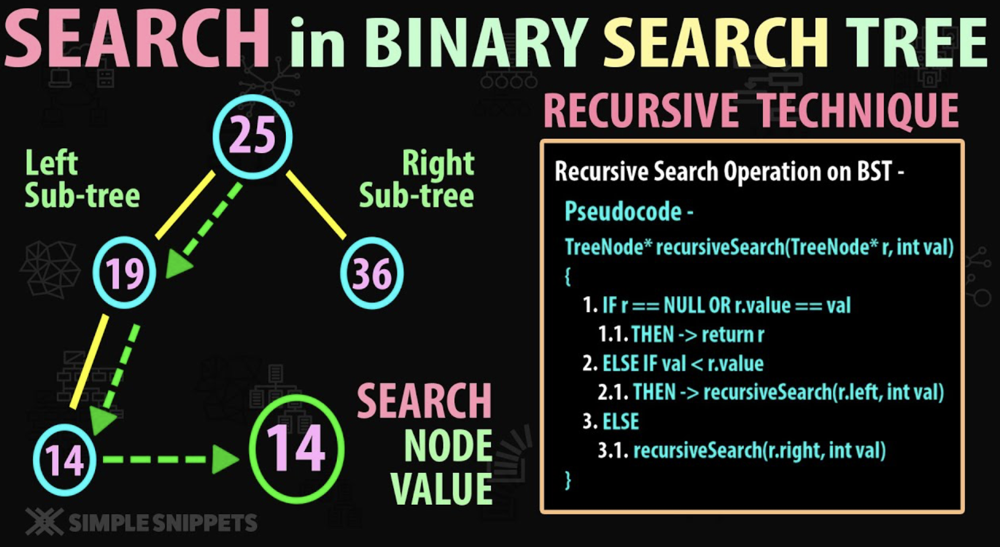

# 4. Чисто функциональные структуры данных.

## Основные принципы

1. **Неизменяемость:**
    - Данные не изменяются после создания. Вместо этого при каждой операции создается новая версия структуры данных.
    - Это делает структуры данных потокобезопасными и упрощает параллельное выполнение.
2. **Персистентность:** Все версии структуры остаются доступными после изменений.
    - Все предыдущие версии структуры данных сохраняются и доступны для использования.
    - Это позволяет эффективно работать с историей изменений.
3. **Эффективность:**
    - Чисто функциональные структуры данных стремятся *минимизировать* накладные расходы на копирование, используя **общие части данных** между старыми и новыми версиями.

## Примеры чисто функциональных структур данных

- **Связный список (Linked Lists)**
    - Добавление элемента в начало списка создает новый список, который ссылается на старый, не изменяя его.
- **Деревья (Trees):**
    - Бинарные деревья поиска, AVL-деревья, красно-черные деревья и другие могут быть реализованы как чисто функциональные структуры.
    - При вставке или удалении элемента создается новое дерево, но большая часть структуры может быть переиспользована.
- **Персистентные массивы (Persistent Arrays):**
    - Например, в языке Clojure используется структура данных Vector, которая позволяет эффективно добавлять и изменять элементы, создавая новые версии массива.
- **Хеш-мапы (Hash Maps)**:
    - В функциональных языках, таких как Clojure или Scala, хеш-мапы реализованы как неизменяемые структуры данных, использующие trie-деревья или другие эффективные методы для обеспечения персистентности.

### Преимущества

- Обеспечивает **безопасный совместный доступ** - нет необходимости в операциях клонирования
- Позволяет **тривиальный откат** изменений, например, операции отмены, обратный путь, обработка исключений
- Автоматическая **защита от гонок данных** при параллельном программировании
- Более простые **GC (Garbage Collection**)** и **STM (Software Transactional Memory)**
- Рекурсивная организация и обработка? (для функциональщиков проще рекурсии, для остальных итерации)

### Недостатки

- Более **высокая worst-case complexity** по сравнению с лучшими императивными структурами, которые часто несут логарифмические накладные расходы
- **Не** так хорошо **изучены и документированы**
- Требует **управления памятью** (GC или ref counts)
- Вызывает **большее количество allocations** (но не обязательно большее количество мест)

````{dropdown} Лекция Пенской А.В.
## Чисто функциональные структуры данных

Рекурсивный код $\rightarrow$ рекурсивные данные.

A *purely functional data* (PFD) structure is a data structure that can be implemented in a purely functional language. The main difference between an arbitrary data structure and a purely functional one is that the latter is (strongly) immutable.

Пример: Array если copy on write.

*Вопрос:* Какова эффективность таких структур?

----

### Single-linked list

#### Нефункциональное объединение списков


----

#### Функциональное объединение списков


----

### Binary search tree

Вставка в бинарное дерево


----

### Binary Search Tree: <br/> Recursive Search



----

<div class="row"><div class="col">

### Элегантная быстрая сортировка

 <!-- .element height="300px" -->
```haskell
qsort [] = []
qsort (x:xs)
    = qsort (filter (\a -> a <= x) xs)
    ++ [x]
    ++ qsort (filter (\a -> a > x) xs)
```

*Questions:* достоинства и недостатки данной реализации?

----

### Advantages

- Allows safe sharing -- no need for cloning operations
- Allows trivial roll back of changes e.g. undo operations, backtracking, handling exceptions
- Automatically safe from data races in concurrent / parallel programming
- Simpler GC and STM
- Recursive organisation and processing?

</div><div class="col">

### Disadvantages

- Higher worst-case complexity than the best imperative structures often incur a logarithmic overhead
- Not as well studied and documented
- Requires memory management (GC or ref counts)
- Causes more allocations (but not necessarily more residence)

</div></div>

----

*Question*: Как быть со строками?

---


````