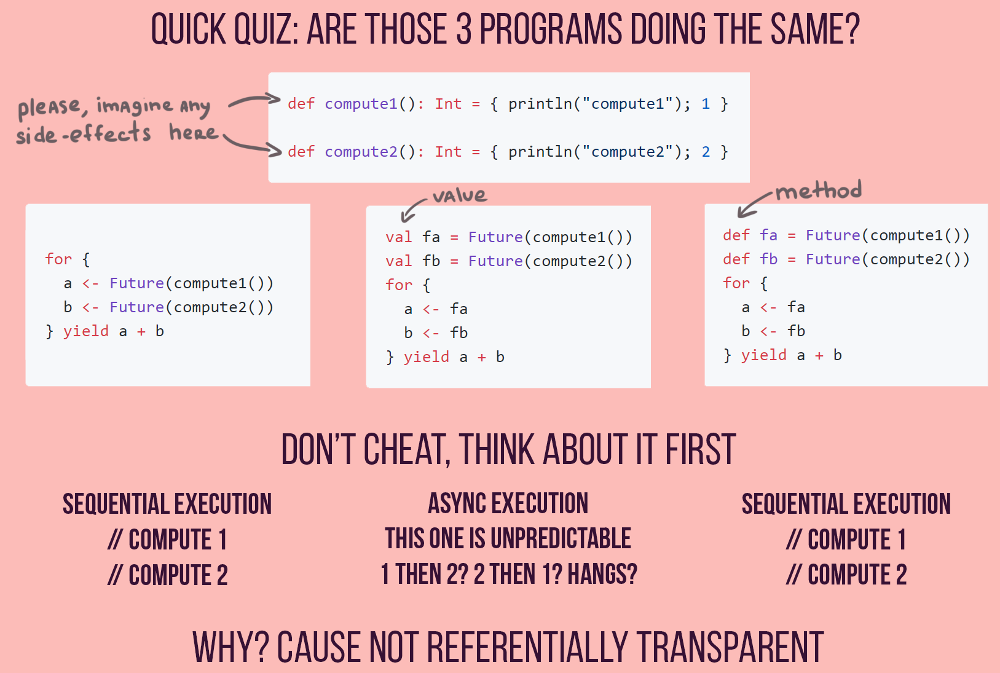

# 5. Ссылочная прозрачность. Сопоставление с образцом

## Ссылочная прозрачность

```{glossary}
Ссылочная прозрачность
    это свойство выражения, когда его можно **заменить результатом** его вычисления без изменения поведения программы. Это свойство обеспечивает предсказуемость кода и отсутствие побочных эффектов.
```

### Особенности

- Характерно для **чистых функций**.
- Гарантирует, что при одинаковых входных данных функция всегда возвращает одинаковый результат.
- Упрощает тестирование, оптимизацию и параллелизацию кода.

## Сопоставление с образцом

```{glossary}
Сопоставление с образцом (англ. pattern matching)
    это механизм, который позволяет «разбирать» структуру данных, сравнивая её с заданным шаблоном (образцом).
```

**Идея следующая:**

1. У нас есть сложная структура данных (список, кортеж, дерево и т. д.).
2. Мы описываем несколько паттернов (образцов), определяя, как данные должны выглядеть, чтобы попасть под конкретный случай.
3. Среда исполнения «пробует» сопоставить текущие данные с каждым образцом по очереди.
4. При успешном сопоставлении выполняется код, связанный с этим шаблоном.

Сопоставление с образцом широко распространено в функциональных языках, такую возможность во многом открывает **иммутабельность**, потому как сопоставленный образец остается доступным к взаимодействию. Если иммутабельности нет, то непонятно, должна ли быть это **копия или ссылка, сколько она должна жить** и тд. Особенно демонстративны примеры с сопоставлением в цикле.

- **В {term}`АТД-языках<Алгебраические (индуктивные) типы данных>`** (Haskell, ML, Rust):

    ```haskell
    area :: Shape -> Float
    area (Circle r) = pi * r^2
    area (Rectangle w h) = w * h
    ```

    - Проверка **полноты**: Компилятор требует обработки всех вариантов.


````{dropdown} Лекции 2, 3 Пенской А.В.
## Ссылочная прозрачность

An expression is called **referentially transparent** if it can be replaced with its corresponding value (and vice-versa) without changing the program's behavior.


Одинаково $\rightarrow$ взаимозаменяемо.
----

#### Примеры эквивалентности <br/> при ссылочной прозрачности

<div class="row"><div class="col">

```python
a = [1, 2, 3]
b = [1, 2, 3]

c = {:a 1 :b 2}
d = {:a 1 :b 2}
```

</div><div class="col">

```python
a = [1, 2, 3]
b = a

c = {:a 1 :b 2}
d = c
```

</div></div>

<div class="row"><div class="col">

```python
a = f(x)
b = f(x)
c = a + b
```

</div><div class="col">

```python
a = f(x)
c = a + a
```

</div></div>

Подстановка выражение, убирание дублирования.

----

<div class="row"><div class="col">

```c
for (int x = 0; x < 100; x++) {
    delete(x);
}
```

</div><div class="col">

```c
for (int x = 0; x < 100; x += 5 ) {
    delete(x);
    delete(x + 1);
    delete(x + 2);
    delete(x + 3);
    delete(x + 4);
}
```

</div></div>

Loop unrolling

<div class="row"><div class="col">

```python
def foo(p, a, b):
    if p(a):
        return b

foo(is_even, x, bar(x))
```

</div><div class="col">

```python
def foo(p, a, b):
    if p(a):
        return bar(x)

foo(is_even, x, x)
```

</div></div>

Reordering

----

```python
def double(x): return x + x

def quadruple(x): return double(double(x))
```

```python
def double(x): return 2 * x

def quadruple(x): return 2 * double(x)
```

```python
def quadruple(x): return 2 * 2 * x
```

```python
def quadruple(x): return 4 * x

print(quadruple(3))  # ==> 12
```

Лёгкий намёк на суперкомпиляцию.

----

И драматизация в рамках параллельного программирования:



----

### Сопоставление с образцом

<div class="row"><div class="col">

```haskell
reverse xs = reverse' xs []
  where
    reverse' [] acc = acc
    reverse' (x:xs) acc = reverse' xs (x:acc)
```

</div><div class="col">

```text
reverse (1:2:[]) =>
reverse' (1:2:[]) [] =>
reverse' (2:[]) (1:[]) =>
reverse' (2:[]) (1:[]) =>
reverse' [] (2:1:[]) =>
(2:1:[])
```

</div></div>

<div class="row"><div class="col">

```erlang
is_z_atom(z) -> true;
is_z_atom(_) -> false.
% is_z_atom(z). % => true
% is_z_atom(123). % => false

is_equal(X, X) -> true;
is_equal(_, _) -> false.
% is_equal(1, 2) % => false.
% is_equal(1, 1)% => true.
```

</div><div class="col">

```clojure
(require '[clojure.core.match :refer [match]])

(doseq [n (range 1 101)]
  (println
    (match [(mod n 3) (mod n 5)]
      [0 0] "FizzBuzz"
      [0 _] "Fizz"
      [_ 0] "Buzz"
      :else n)))
```

</div></div>

----

```clojure
(def x (map #(throw %) (range 1000)))
; (prn x) ?
```

```clojure
(prn x) ; => Execution error ... (
; (prn x) ?
```
<!-- .element: class="fragment" -->

```clojure
(prn x) ; => ()

(def y (map #(if (= % 40) (throw %) %) (range 100)))
; (prn x)
; (prn x) ?
```
<!-- .element: class="fragment" -->

```clojure
(prn y) ; => Execution error ... (0 1 2 ...... 27 28 29 30
(prn y) ; => (0 1 2 3 4 5 6 7 8 9 10 11 ...... 27 28 29 30 31)

(let [z (map #(if (= % 2) (throw %) %) [1 2 3])]
  (.start (Thread. #(doall z)))
  (Thread/sleep 100)
  z)
; Return or exception?
```
<!-- .element: class="fragment" -->

```clojure
; => ()
```
<!-- .element: class="fragment" -->

````
