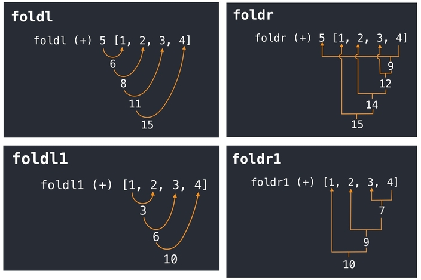
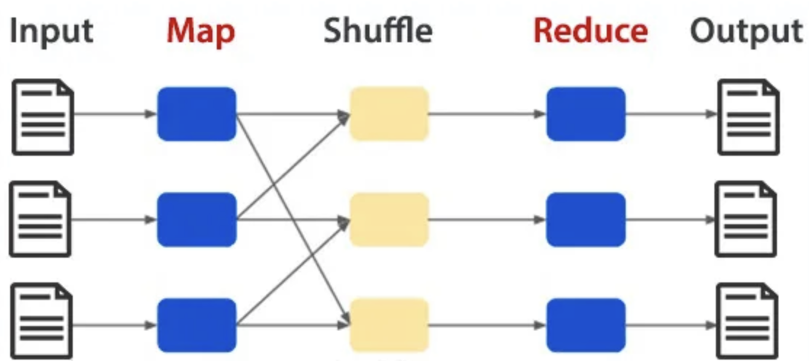

# 8. Свёртки. Отображения. Фильтрация. Map-reduce. Бесточечный стиль, комбинаторы

## Свёртки. Отображения. Фильтрация

### Свёртки

```{glossary}
Свёртка (Fold)
    это операция, которая преобразует коллекцию элементов в одно значение путём последовательного применения функции к элементам и аккумулятору.
```

**Существует два основных типа свёрток:**

- **Левая свёртка (foldl)** — обрабатывает элементы слева направо.
- **Правая свёртка (foldr)** — обрабатывает элементы справа налево.



```haskell
foldl (+) 0 [1, 2, 3, 4]  -- Результат: 10 (0 + 1 + 2 + 3 + 4)
foldr (*) 1 [1, 2, 3, 4]  -- Результат: 24 (1 * 2 * 3 * 4 * 1)
```

**Примечание**: Правая свёртка, выполняющаяся по связному списку, может значительно увеличить потребление ресурсов = необходимо сначала произвести реверс списка.

### Отображения

```{glossary}
Отображение (Map)
    это операция, которая применяет функцию к каждому элементу коллекции и возвращает новую коллекцию результатов.
```

```python
list(map(lambda x: x * 2, [1, 2, 3, 4]))  # Результат: [2, 4, 6, 8]
```

### Фильтрация

```{glossary}
Фильтрация (Filter)
    это операция, которая выбирает элементы коллекции, удовлетворяющие определённому условию (предикату).
```

```python
list(filter(lambda x: x % 2 == 0, [1, 2, 3, 4]))  # Результат: [2, 4]
```

## Map-Reduce
```{glossary}
Map-Reduce
    это модель обработки данных (часто распределённых) от компании Google, состоящая из двух этапов:
    - **Map**: Применение функции к каждому элементу коллекции
    - **Reduce**: Сведение результатов в одно значение (Агрегация результатов)
```



### Трудности реализации:

1. **Обработка ошибок:** При работе с большими распределёнными системами важно корректно обрабатывать ошибки, такие как сбои при обработке данных или сети. Перезапуск задач и восстановление состояния после ошибок требуют сложных механизмов для обеспечения устойчивости.
2. **Проблема остановки/отмены:** Остановка или отмена задач на одном из этапов (например, на этапе Reduce) может привести к нарушению согласованности данных или к потере результатов, если не предусмотрены механизмы для корректного завершения работы с учётом уже обработанных данных.
3. **Консистентность:** В распределённых системах важно поддерживать консистентность данных, особенно при параллельной обработке. Без надлежащей синхронизации могут возникнуть проблемы с некорректным объединением результатов, что приведёт к ошибкам в итоговых вычислениях.
4. **Отказ узлов:** Отказ отдельных узлов в распределённой системе может привести к потерям данных или замедлению работы, если не предусмотрены механизмы восстановления или перераспределения задач между оставшимися активными узлами.

## Бесточечный стиль, комбинаторы

```{glossary}
Бесточечный стиль (Point-free style)
    это подход в функциональном программировании, при котором функции определяются без явного указания аргументов, за счёт комбинации других функций.

Комбинаторы
    это функции или операторы, которые позволяют комбинировать или преобразовывать функции для достижения бесточечного стиля.

Каррирование (Currying)
    преобразование функции от многих аргументов в набор вложенных функций, каждая из которых является функцией от одного аргумента.

Композиция функций (Function composition)
    позволяет объединять несколько функций в одну, так что результат одной функции передаётся в другую.
```

Примеры:

```java
// Java (Stream API)
Stream.of("a1", "a2", "a3")
    .map(s -> s.substring(1))
    .mapToInt(Integer::parseInt)
    .max()
    .ifPresent(System.out::println);
```

```python
# Python
import functools

add = lambda a, b: a + b # Определяем анонимную функцию сложения
inc = functools.partial(add, 1) # Создаем функцию, которая увеличивает число на 1

def comp(g, h): # Определяем композицию функций
    return lambda x: g(h(x))  # Возвращаем функцию, которая применяет g к результату h(x)

inc2 = comp(inc, inc) # Композиция inc и inc, то есть увеличение числа дважды

inc2(1) # Результат применения inc2 к числу 1
# => 3
```

### Haskell

1. Каррирование:

```haskell
-- Haskell
inc = (+1) -- Функция увеличивает число на 1
inc2 x = inc (inc x) -- Функция увеличивает число на 2 (два раза применяет inc)

inc2 1 -- Вызов функции inc2
-- => 3
```

2. Композиция функций ((.)):

```haskell
-- Обычный стиль
sumSquares xs = sum (map (^2) xs)

-- Бесточечный стиль
sumSquares = sum . map (^2)
```

### Clojure
1. `partial` (частичное применение):

```clojure
(def inc (partial + 1))
(inc 1)  -- => 2
```

2. `comp` (композиция функций):

```clojure
(def inc2 (comp inc inc))
(inc2 1)  -- => 3
```

3. Потоковые макросы (`->`, `->>`):

```clojure
(defn calculate* []
   (->> (range 10)
        (filter odd?)
        (map #(* % %))
        (reduce +)))
```

- `->` (thread-first): Передает результат текущего выражения как первый аргумент следующей функции.
- `->>` (thread-last): Передает результат текущего выражения как последний аргумент следующей функции.
